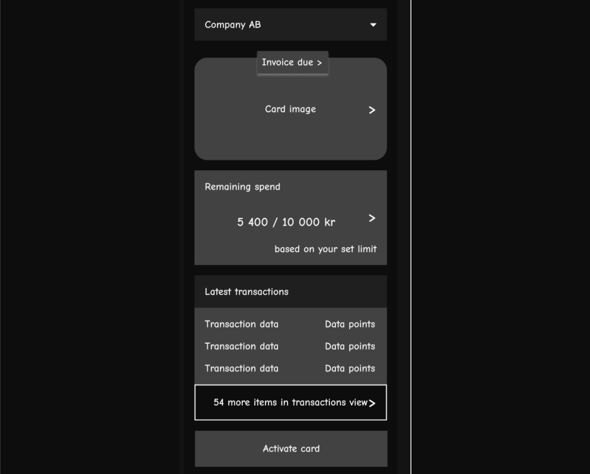

# Finova-docs

## Project: Finova

This project signifies a forward-thinking and innovative platform for financial management within a corporate or enterprise context. 


In the backend development, I implemented a domain-driven design approach to structure the project codebase, aligning complex business logic with distinct business domains. User authentication processes, including signup, login, and secure password change, were secured through the incorporation of JWT for tokenization and bcrypt for password hashing and comparison.

I leveraged the Joi library for input validation, ensuring that only valid data is processed. Additionally, Cron was employed to execute scheduled tasks, such as the automatic expiration of cards and periodic resetting of spending limits.

The introduction of a robust card spending limit feature serves multiple strategic purposes, encompassing expense management, budgetary control, preemptive measures against unauthorized transactions, and potential fraud scenarios, such as unauthorized card usage or theft. This approach aims to provide a secure and seamlessly functional financial environment.


## Tech Stack: 
Nodejs, Express, PostgreSQL, TypeORM.

## Features: 
``` 
<<<< Company >>>>
- Signup
- Login
- Change of password
- Get company
- Get companies(paginated and search)
- Update company's information
- Deactivate company

<<<< Account >>>> 
- Create account for company (company add more accounts by company)
- Get account(search by card number)
    
<<<< Card >>>>
- Create card for company (Company can add more cards)
- Get card
- Activate card
- Update card pin
- Get pending cards
- Get activated cards
- Set spending limit on card

<<<< Transaction >>>>
- Fetch all transactions
- Internal transfer of funds (no payment integrations yet implemented but will as I continue to build)

<<<< Cro job functions >>>>
- Expire card when due
- Reset spend limit and remaining spend when due
 ```
 
## System architecture explanation
 
 This is a description of a financial system with entities such as Account, Card, Company, and Transaction. Let's break down how these entities relate to each other in a system architecture.

* Database Layer:
    * A relational database(PostgreSQL) to store and manage data. Entities like Account, Card, Company, and Transaction will translate to tables in the database.

* ORM (Object-Relational Mapping):
    * An ORM framework(typeORM) to map database tables to classes in your code. This makes it easier to interact with the database using object-oriented programming principles.

* Repository Logic Layer:
    * Implement the repository logic of the system. This layer includes the database logic related to the company, transaction, account, and card. Here, methods are defined that interact with the ORM to perform actions such as transferring funds, retrieving card information, transactions, etc.

* API Layer(controllers):
    * Expose APIs (Application Programming Interfaces) for external systems or applications to interact with the financial system. This layer would communicate with the business logic layer to perform actions like signup, login, creating an account,  processing transactions, or querying card information based on user input and displaying relevant information.

    * Implement input validation in the API layer to ensure that only valid and sanitized data is processed using Joi.

* Security Layer:
    * Implement security measures to protect sensitive financial data. This includes hashing of passwords and sensitive information, user authentication, and authorization mechanisms.

* Logging:
    * Implement logging to track system activities. This is crucial for identifying and addressing issues.

* Third-Party Integrations (coming soon):
    * My system needs to interact with external services or APIs (e.g., payment integration to enable transfer and account funding), thus replacing the current internal transfer feature.

* Documentation:
    * Document your API endpoints using tools like  Postman to facilitate development, and collaboration, and create a detailed README file to guide developers on how to use your APIs effectively.


### Initial sketch mobile app view



## Technical challenges:

Using Express/Node.js can be a powerful combination for building functionalities. Here's a high-level overview of how I  leverage these technologies to overcome the technical challenges:

* Routing with Express:
    * Organize your routes in a modular way using Express Router. For example, you can have separate route files for Company, Account, Card, and Transaction functionalities.

* Middleware for Authentication and Authorization:
    * Implement middleware functions to handle user authentication and authorization. This ensures that only authenticated and authorized users can access certain routes, enhancing security.

* User Authentication and Password Change:
    * Use a secure authentication mechanism, such as JWT (JSON Web Tokens), to handle user authentication during the signup and login process.

    * Implement a secure password change mechanism by hashing and salting passwords(bcrypt)

* Database Integration with TypeORM:
    * Utilize TypeORM to easily connect my Express application to the PostgreSQL database and perform CRUD operations. Define entities for Company, Account, Card, and Transaction to map them to database tables.

* Pagination and Search:
    * Implement paginated and search functionalities using query parameters in my Express routes. Leverage the capabilities of your ORM (TypeORM) to efficiently query and filter data.

* Scheduled Tasks with Cron Jobs:
    * Use a library like cron to schedule and run cron jobs for functions like expiring cards and resetting spending limits. Ensure that these jobs run reliably in the background.

* Transaction Handling:
    * Implement routes for fetching all transactions and transferring funds between company accounts. Ensure that these transactions are handled atomically to maintain data consistency.

* Card Activation and Updates:
    * Implement routes for card activation, updating card PIN, and setting spending limits. Use middleware to check the card's status before performing these actions.


## What made you proud while developing this product/feature?

I feel proud because I am excited about creating a tool that lets people easily do important money stuff, like signing up, managing accounts, and making transactions. Seeing it all work smoothly gives me a happy feeling!Also, I feel this will effectively solve real problems for users as I continue to make improvements to the project and this can also be put out as open source for developers to contribute and others to learn.

## Have you proposed a clever solution?
Yes, I will continuously add improvements and features needed to make the project a big shot.💥

# Link to project code on Github
Public link to project code [Github link](https://github.com/AbonyiXavier/Finova)
